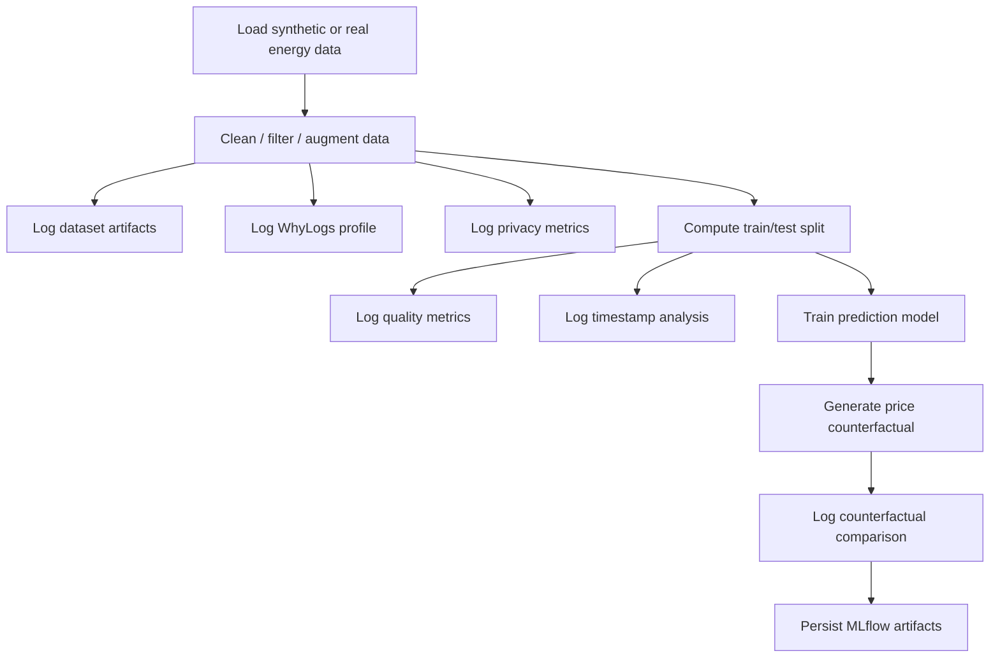

# Data Analysis Helpers

This package contains the data-analysis helpers used by the CERTAIN workflow to log profiling, quality, privacy, and counterfactual information into MLflow and the downstream sync pipeline.

The package is designed as a thin, reusable library layer. The workflow builds the dataset and trains the models, while this package computes metrics, generates artifacts, and exposes a consistent logging interface.

## Package Overview

The main modules a re:

- `log_dataset.py` - logs datasets and train/test splits
- `log_timeseries.py` - logs timestamp statistics
- `log_whylogs.py` - logs WhyLogs profiles
- `log_quality.py` - computes and logs data quality scores
- `log_privacy.py` - computes and logs privacy scores
- `log_counterfactuals.py` - generates and logs counterfactuals
- `log_demographic_bias.py` - clusters session data and builds demographic bias reports
- `log_drift_metrics.py` - computes drift metrics between datasets
- `log_data_techniques.py` - logs preprocessing / augmentation techniques

All of the main helpers are exported from `certain_library.data_analysis.__init__` for convenient imports.

## Execution Flow

The workflow uses these helpers in a fixed order. The high-level flow is:



The workflow is intentionally split into three phases:

1. preprocessing and profiling before model training
2. quality / privacy checks on the cleaned dataset
3. counterfactual generation after the price model is trained

## Function Reference

### 1. Data Quality

Implemented in `log_quality.py`.

Main functions:

- `log_quality_from_data(...)`
- `compute_4d_quality_index(...)`
- `log_4d_quality_metrics(...)`

#### What it does

`log_quality_from_data(...)` is the entry point used by the workflow. It:

- logs dataset artifacts with `log_dataset(...)` or `log_train_test_dataset(...)`
- logs WhyLogs profiles with `log_whylogs_profile(...)`
- optionally logs timestamp analysis with `timestamp_analysis(...)`
- computes four quality dimensions:
  - completeness
  - accuracy
  - consistency
  - timeliness
- writes a JSON artifact under `certain/log_quality`

#### How the score is computed

`compute_4d_quality_index(...)` works from a metadata dictionary and applies the following rules:

- completeness: $1 -$ mean null ratio across the dataset columns
- accuracy: numeric outlier ratio based on a $z > 3$ rule
- consistency: schema violations plus optional range-based consistency
- timeliness: average timestamp gap transformed into a bounded score
- composite score: simple average of the four dimensions

The consistency implementation supports both:

- schema consistency: penalizes columns that are entirely missing
- range consistency: penalizes numeric values outside user-provided bounds

If `consistency_ranges` is passed, the final consistency score averages schema consistency and range consistency.

#### Example

```python
from certain_library.data_analysis.log_quality import log_quality_from_data

quality_scores = log_quality_from_data(
    tracker,
    data=df_sorted,
    train_data=train_combined,
    test_data=test_combined,
    consistency_ranges={
        "DE_price_day_ahead": {"min": 0.0, "max": 100.0},
    },
    data_id=run.info.run_id,
)
```

#### Typical artifact output

- `certain/log_quality/quality_metrics.json`

---

### 2. Privacy

Implemented in `log_privacy.py`.

Main functions:

- `compute_k_anonymity(...)`
- `compute_l_diversity(...)`
- `log_privacy_metrics(...)`
- `log_privacy_from_data(...)`

#### What it does

`log_privacy_from_data(...)` computes and logs privacy metrics for a tabular dataset. It:

- treats the provided quasi-identifiers as grouping columns
- computes k-anonymity as the minimum equivalence class size
- computes l-diversity when a sensitive column is provided
- logs the results to the tracker
- writes a JSON artifact under `certain/log_privacy`

#### How the score is computed

- `k_anonymity`: size of the smallest group after grouping by the quasi-identifiers
- `l_diversity`: minimum number of distinct sensitive values within any quasi-identifier group
- optional differential privacy parameters are logged when provided (`epsilon`, `delta`)

#### Example

```python
from certain_library.data_analysis.log_privacy import log_privacy_from_data

log_privacy_from_data(
    tracker,
    df_sorted,
    quasi_identifiers=[
        "DE_load_actual_entsoe_transparency",
        "DE_solar_generation_actual",
        "DE_wind_onshore_generation_actual",
        "DE_wind_offshore_generation_actual",
    ],
    sensitive_column="DE_price_day_ahead",
    data_id=run.info.run_id,
)
```

#### Typical artifact output

- `certain/log_privacy/privacy_metrics.json`

---

### 3. Counterfactuals

Implemented in `log_counterfactuals.py`.

Main functions:

- `generate_price_counterfactual(...)`
- `evaluate_counterfactuals(...)`
- `log_counterfactual_metrics(...)`
- `log_counterfactual_from_data(...)`

#### What it does

This module has two responsibilities:

1. generate a counterfactual candidate using a trained model and a discrete search grid
2. evaluate and log the difference between the original and counterfactual records

The workflow uses `generate_price_counterfactual(...)` to search for a model-based what-if scenario and then uses `log_counterfactual_from_data(...)` to record the comparison.

#### How the generator works

`generate_price_counterfactual(...)`:

- takes a single original row
- keeps the observation fixed except for intervention features
- predicts the original outcome with the price model
- searches over wind-generation multipliers
- finds the smallest intervention that pushes the predicted price below the target threshold, if possible
- raises an error if no valid changed counterfactual can be found

The current workflow uses this helper to search for a counterfactual where the predicted electricity price falls below €60/MWh.

#### How the metrics are computed

`evaluate_counterfactuals(...)` computes:

- average L1 distance
- average L2 distance
- sparsity of changes
- immutable-feature violations

`log_counterfactual_metrics(...)` logs those values through the tracker.

`log_counterfactual_from_data(...)` then writes a JSON artifact under `certain/log_counterfactuals`.

#### Example

```python
from certain_library.data_analysis.log_counterfactuals import (
    generate_price_counterfactual,
    log_counterfactual_from_data,
)

original_cf, counterfactual_cf, original_price, cf_price, metadata = (
    generate_price_counterfactual(
        original_row=test_combined.iloc[[0]],
        price_model=price_model,
        feature_columns=price_feature_columns,
        target_price=60.0,
    )
)

log_counterfactual_from_data(
    tracker,
    original_df=original_cf,
    counterfactual_df=counterfactual_cf,
    protected_columns=["DE_load_actual_entsoe_transparency"],
    data_id=run.info.run_id,
)
```

#### Typical artifact output

- `certain/log_counterfactuals/counterfactual_metrics.json`

---

### 4. Demographic Bias

Implemented in `log_demographic_bias.py`.

Main functions:

- `analyze_demographic_bias(...)`
- `build_demographic_bias_artifacts(...)`
- `log_demographic_bias_from_data(...)`
- `build_batch_demographic_bias_artifacts(...)`
- `compute_age_bucket(...)`

#### What it does

This module ports the attached demographic clustering workflow into the library layer. It:

- flattens the clean and dirty session JSON payloads into tabular records
- buckets age into ranges and tracks nationality / background / opinion distributions
- clusters the text with TF-IDF + KMeans when scikit-learn is available, with a deterministic fallback otherwise
- computes per-cluster total-variation-distance signals against the whole dataset
- compares clean vs dirty batches and highlights shifts in representation
- writes JSON and HTML bias artifacts under `certain/demographic_bias`

#### Example

```python
from certain_library.data_analysis.log_demographic_bias import log_demographic_bias_from_data

report = log_demographic_bias_from_data(
    tracker,
    clean_df=clean_df,
    dirty_df=dirty_df,
    age_range=(30, 40),
    countries=["Greece", "Italy"],
    dataset_name="greece_italy_subset",
)
```

#### Typical artifact output

- `certain/demographic_bias/<name>_demographic_bias_report.json`
- `certain/demographic_bias/<name>_demographic_bias_report.html`

---

### 4. Drift Metrics

Implemented in `log_drift_metrics.py`.

Main function:

- `log_drift_metrics(...)`

#### What it does

- compares train and test numeric columns
- computes a KS-test per common numeric feature
- logs the results as metrics
- writes a deterministic artifact under `certain/drift_metrics`

This is used to monitor dataset shift between the training and test partitions.

---

### 5. Data Techniques

Implemented in `log_data_techniques.py`.

Main function:

- `log_data_techniques(...)`

#### What it does

- logs the data-preprocessing / augmentation strategy used by the workflow
- captures technique names, parameters, and stage tags
- writes the artifact so the sync layer can map the transformation history

The workflow uses this module to store the preprocessing strategy alongside the model run.

---

### 6. Dataset and Time-Series Profiling

Implemented in:

- `log_dataset.py`
- `log_timeseries.py`
- `log_whylogs.py`

#### Dataset logging

`log_dataset(...)` and `log_train_test_dataset(...)` normalize tabular inputs into a DataFrame, then log them as dataset artifacts.

#### Timestamp analysis

`timestamp_analysis(...)` records min, max, and mean timestamps for train and test data and writes a text artifact of all timestamps.

#### WhyLogs profiling

`log_whylogs_profile(...)` creates a WhyLogs profile for the DataFrame and logs the profile as an artifact.

These helpers are used by the quality and workflow layers before model training.

## Where the artifacts go

All new helpers write into the `certain/` MLflow artifact namespace:

- `certain/log_quality`
- `certain/log_privacy`
- `certain/log_counterfactuals`
- `certain/whylogs`
- `certain/timestamps`
- `certain/data_techniques`
- `certain/drift_metrics`

The data transfer layer later reads these artifacts and syncs them into the PostgreSQL-backed tables.

## Workflow Integration

In `test_docker/test_complete_workflow.py`, the sequence is:

1. create the synthetic energy dataset
2. clean and augment the dataset
3. log WhyLogs and dataset artifacts
4. compute privacy metrics on the cleaned dataset
5. split into train/test sets
6. log quality metrics with timestamp and range checks
7. compute drift between train and test
8. train the forecasting model
9. train a separate price model for counterfactual generation
10. generate a model-based price counterfactual
11. log the counterfactual comparison metrics and artifact

That separation keeps the workflow readable and makes each helper independently testable.

## Minimal Import Example

```python
from certain_library.data_analysis import (
    log_quality_from_data,
    log_privacy_from_data,
    generate_price_counterfactual,
    log_counterfactual_from_data,
)
```

## Technical Notes

- The counterfactual generator is deterministic and discrete.
- It only uses a small intervention grid, so it is easy to test and reason about.
- The generator raises if it cannot find a changed counterfactual, which prevents misleading zero-distance logs.
- Range-based consistency is optional and only applied when `consistency_ranges` is provided.

## Design Goal

The package is meant to keep the workflow simple and explicit:

- the workflow creates the data and trains the model
- this package computes metrics and generates artifacts
- the sync layer reads the artifacts and writes them into the database

This keeps the logging logic reusable, inspectable, and easy to extend.
